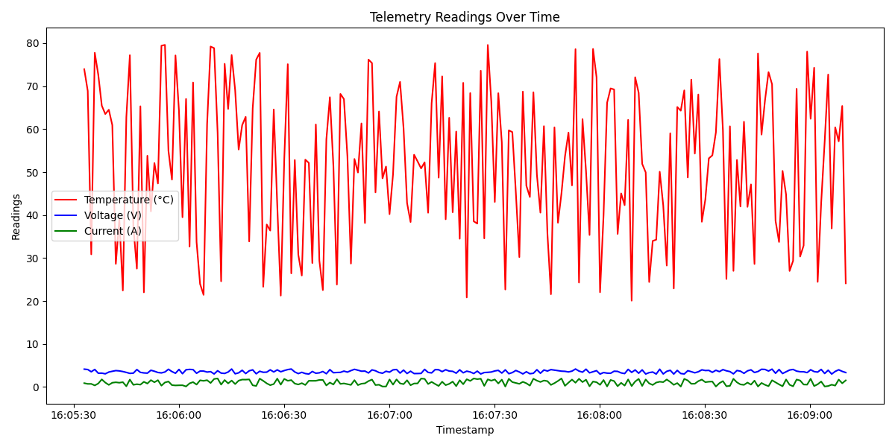

# 🛰️ Fault-Tolerant Task Scheduler for Spacecraft Systems

A simulated fault-tolerant scheduler inspired by real-time embedded systems used in spacecraft and satellite applications. This project demonstrates robust task handling, telemetry logging, and real-time failure monitoring — all built in Python without relying on hardware.

---

## Features

- ⏱️ **Task Scheduler:** Executes simulated onboard tasks with built-in failure and retry logic.
- 📡 **Telemetry Logger:** Periodically logs system metrics like temperature, voltage, and current.
- 🔁 **Batch Logging:** Logs telemetry data in defined batches to reduce overhead.
- 📊 **Data Visualization:** Graphs system health metrics and failure statistics for review.
- ⚠️ **Monitoring Module:** Identifies recurring failures and flags potential system risks.

---


## How It Works

1. **Simulated Tasks** are executed with random failure chances.
2. **Telemetry** is logged in real-time (temperature, voltage, current, status).
3. **System Log Monitor** analyzes the telemetry log and visualizes failure rates.
4. **Graphs** help identify anomalies or unhealthy patterns.

---

## Sample Outputs

- 
  Time series graph for telemetry readings.


---

###  Clone the repository
```bash
git clone https://github.com/<your-username>/fault_tolerant_task_scheduler.git
cd fault_tolerant_task_scheduler


